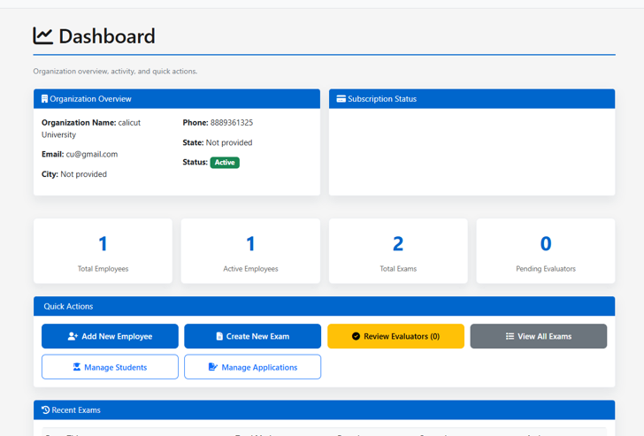
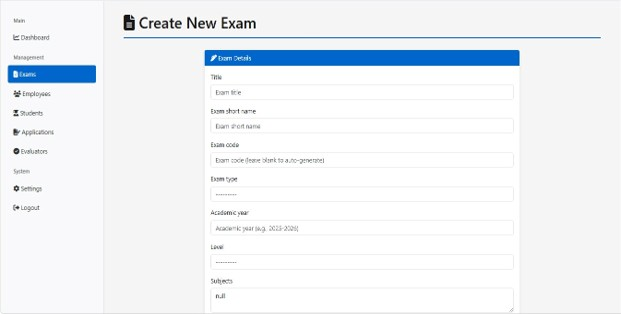
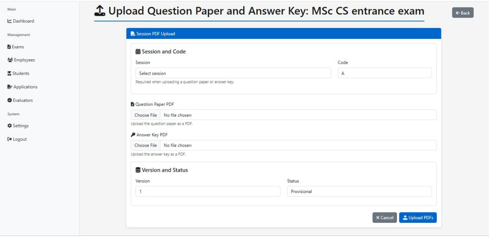
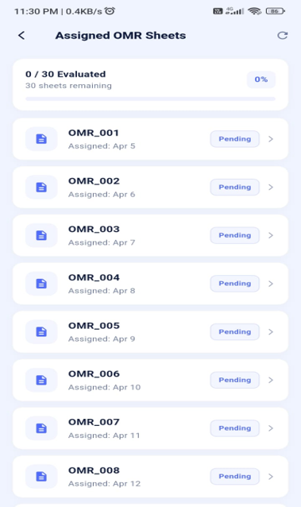
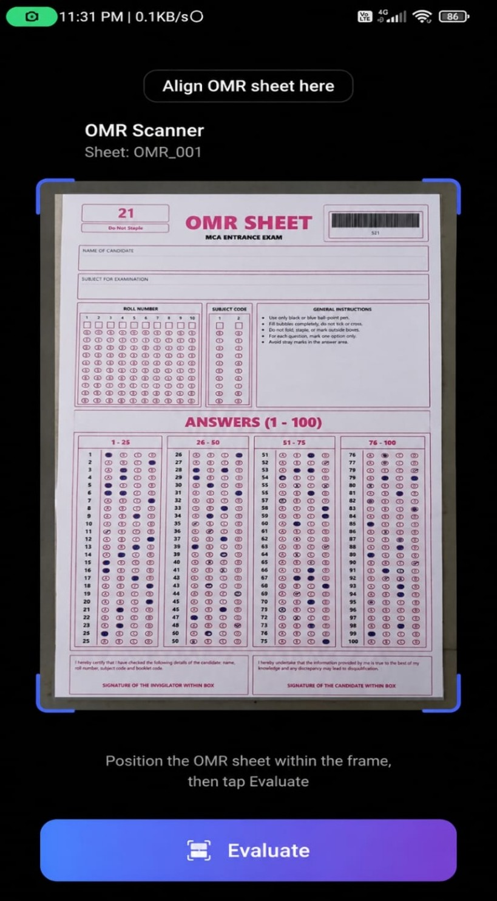
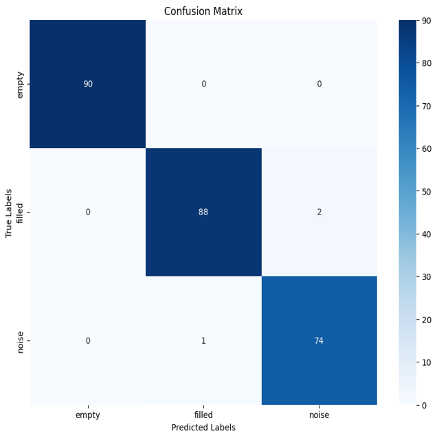

# 📝 ExamAIR – AI-Based Digital OMR Examination Evaluation System

## 📖 Overview

**ExamAIR** is an AI-powered Digital OMR Examination Evaluation System developed as my **Master of Computer Applications (MCA) Final Semester Major Project**.

The project automates the complete offline examination evaluation process using **Artificial Intelligence, Computer Vision, Django, Flutter, and MySQL**.

Unlike traditional OMR systems, ExamAIR provides an end-to-end solution where administrators can manage examinations through a web application, while evaluators use a Flutter mobile application to scan OMR sheets for automatic evaluation.

---

# 🎯 Objectives

- Automate offline examination evaluation.
- Eliminate manual OMR correction.
- Reduce human errors.
- Improve evaluation speed and accuracy.
- Provide centralized examination management.
- Generate instant results using AI.

---

# 🚀 Key Features

## 👨‍💼 Admin Web Application

- User Authentication
- Institution Management
- Employee Management
- Evaluator Management
- Exam Creation
- Question Management
- Answer Key Upload
- Candidate Management
- OMR Template Management
- Evaluation Monitoring
- Result Management
- Reports & Analytics

---

## 📱 Evaluator Mobile Application

A Flutter-based mobile application developed for evaluators.

Features include:

- Secure Login
- View Assigned Exams
- Scan OMR Sheets
- Upload OMR Images
- Automatic Evaluation
- View Evaluation Status
- Result Synchronization with Server

The evaluator only needs to scan the OMR sheet using the mobile camera. The application automatically uploads the image for AI-based processing and displays the evaluation result.

---

## 🤖 AI-Based OMR Evaluation

- Image Preprocessing
- Perspective Transformation
- Image Alignment
- Noise Removal
- Bubble Detection
- Bubble Segmentation
- CNN-Based Bubble Classification
- Answer Prediction
- Automatic Score Calculation

---

# 🛠️ Technologies Used

## Backend

- Python
- Django
- Django REST Framework

## Mobile App

- Flutter
- Dart

## Artificial Intelligence

- TensorFlow
- Keras
- Convolutional Neural Network (CNN)

## Computer Vision

- OpenCV

## Database

- MySQL

## Libraries

- NumPy
- Pandas
- Matplotlib

## Tools

- Git
- GitHub
- VS Code
- Jupyter Notebook

---

---

# ⚙️ Workflow

### Step 1

Administrator creates an examination.

↓

### Step 2

Questions and Answer Keys are uploaded.

↓

### Step 3

Candidates appear for the examination using printed OMR sheets.

↓

### Step 4

Evaluator logs into the Flutter application.

↓

### Step 5

Evaluator scans the completed OMR sheet.

↓

### Step 6

The scanned image is uploaded to the Django backend.

↓

### Step 7

OpenCV preprocesses the image.

- Image Enhancement
- Thresholding
- Perspective Correction
- Alignment

↓

### Step 8

Answer bubbles are extracted.

↓

### Step 9

CNN model classifies each bubble as:

- Filled
- Empty
- Noise

↓

### Step 10

Predicted answers are compared with the Answer Key.

↓

### Step 11

Marks are calculated automatically.

↓

### Step 12

Results are stored in the MySQL database and displayed in the web application.

---

# 📂 Modules

## 🔐 Authentication Module

- Login
- Role-based Access
- User Management

---

## 🏫 Institution Module

- Institution Registration
- Employee Management
- Evaluator Management

---

## 📝 Examination Module

- Exam Creation
- Question Bank
- Answer Keys
- Candidate Registration

---

## 📱 Evaluator Module

- Assigned Exams
- Mobile Login
- Scan OMR Sheet
- Upload Images
- Evaluation Status

---

## 🤖 AI Processing Module

- Image Preprocessing
- Bubble Detection
- CNN Prediction
- Score Calculation

---

## 📊 Result Module

- Automatic Evaluation
- Result Generation
- Reports
- Analytics

---

# 🧠 AI Model

The AI model was trained using a custom-created OMR dataset.

Pipeline:

Dataset Creation

↓

Image Preprocessing

↓

CNN Model Training

↓

Model Validation

↓

Bubble Classification

↓

Answer Prediction

---

# 📈 Project Highlights

✔ Django REST Backend

✔ Flutter Mobile Application

✔ AI-Powered OMR Evaluation

✔ CNN-Based Bubble Prediction

✔ OpenCV Image Processing

✔ MySQL Database

✔ Automatic Result Generation

✔ Centralized Examination Management

✔ Mobile OMR Scanning

---

# 📚 Learning Outcomes

Through this project I gained practical experience in:

- Python Development
- Django Backend Development
- REST API Development
- Flutter Mobile Development
- OpenCV
- Computer Vision
- Deep Learning
- CNN Model Development
- TensorFlow & Keras
- MySQL Database Design
- Image Processing
- Software Testing
- Git & GitHub
- Agile Development

---

# 🎓 Academic Information

**Project Title**

ExamAIR – AI-Based Digital OMR Examination Evaluation System

**Degree**

Master of Computer Applications (MCA)

**University**

Kannur University

**Department**

School of Information Science and Technology

**Student**

Amrutha Balan
---

# 📌 Project Status

## ✅ Completed

This project was successfully completed as the MCA Final Semester Major Project.

It demonstrates the integration of **Artificial Intelligence, Computer Vision, Django Backend Development, Flutter Mobile Development, REST APIs, and Database Management** to build a complete AI-assisted examination evaluation platform.

---
# 📸 Screenshots

## Admin & Employee Login

---

## Admin Dashboard

---

## Exam Creation

---

## OMR Upload

---

## Evaluator Login

---

## Assigned OMR

---

## Scan OMR

---

## Evaluation Result

---

## CNN Confusion Matrix

---

## 👩‍💻 Developed By

**Amrutha Balan**

MCA Graduate | Python & Django Developer | AI/ML Enthusiast

📧 Email: amruthabala18@gmail.com

🔗 LinkedIn: https://www.linkedin.com/in/amrutha-balan-5585aa200/

💻 GitHub: https://github.com/amrutha612
